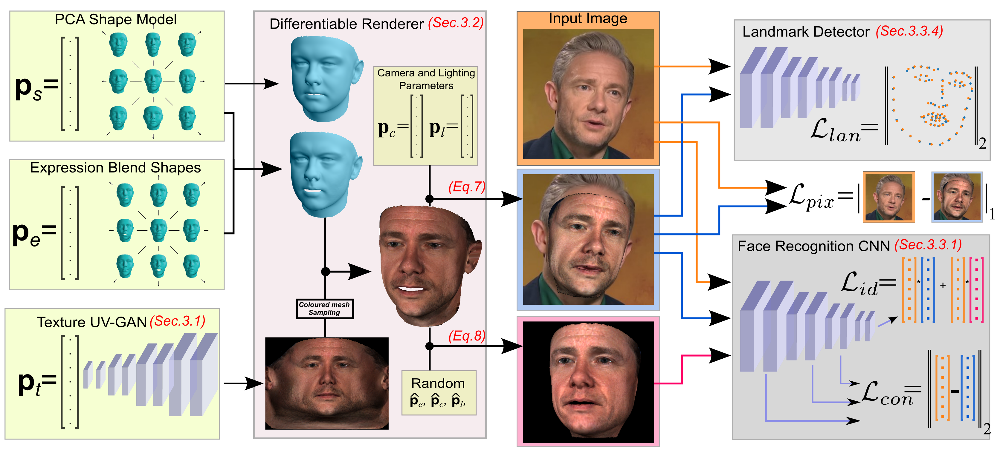
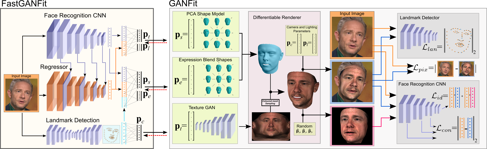
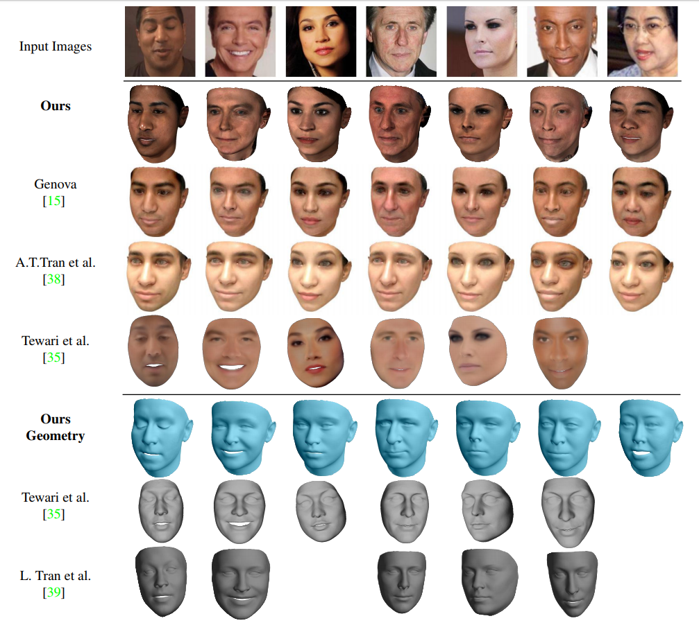
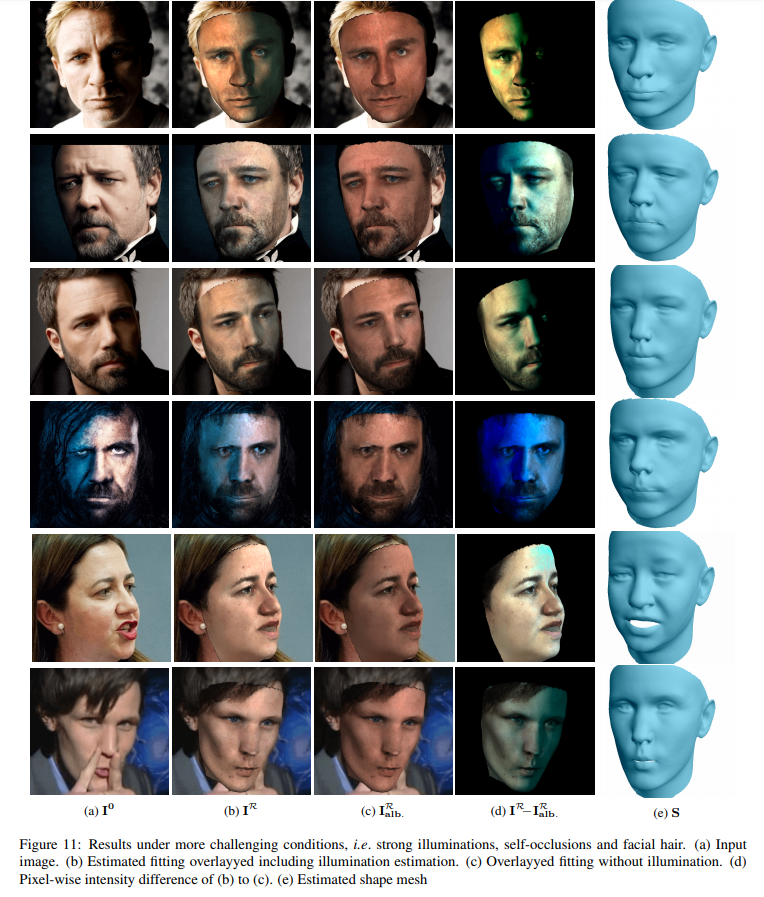

# [GANFIT: Generative Adversarial Network Fitting for High Fidelity 3D Face Reconstruction](http://openaccess.thecvf.com/content_CVPR_2019/html/Gecer_GANFIT_Generative_Adversarial_Network_Fitting_for_High_Fidelity_3D_Face_CVPR_2019_paper.html)
[](https://arxiv.org/abs/1902.05978)
#### [CVPR 2019]

# [Fast-GANFIT: Generative Adversarial Network for High Fidelity 3D Face Reconstruction](https://ieeexplore.ieee.org/abstract/document/9442802)
[](https://arxiv.org/abs/2105.07474)
#### [TPAMI 2021]

 [Baris Gecer](http://barisgecer.github.io)<sup> 1,2</sup>, [Stylianos Ploumpis](https://ibug.doc.ic.ac.uk/people/sploumpis)<sup> 1,2</sup>, [Irene Kotsia](https://www.mdx.ac.uk/about-us/our-people/staff-directory/profile/kotsia-irene)<sup> 3</sup>, & [Stefanos Zafeiriou](https://wp.doc.ic.ac.uk/szafeiri/)<sup> 1,2</sup>
 <br/>
 <sup>1 </sup>Imperial College London
 <br/>
 <sup>2 </sup>FaceSoft.io
 <br/>
 <sup>3 </sup>University of Middlesex


<br/>

<p align="center"></p>

* :pushpin: GANFit now has a faster (called FastGANFit) and a more stable (called GANFit++) versions. See our [TPAMI](https://arxiv.org/abs/2105.07474) paper for the details
* :pushpin: Evaluation code of GANFit and FastGANFit on MICC Florence dataset is now available ([see below for instructions](https://github.com/barisgecer/GANFit#micc-florence-evaluation-code))
* :pushpin: Unfortunately the reconstruction code of these studies has been commercialized, so we cannot share it with anyone. However, if you send some images, we can send back our results for comparison in academic publications.
* :pushpin: We opened another texture-shape model to public with is very similar to GANFit texture model, you can apply for its license here [TBGAN](https://github.com/barisgecer/TBGAN).

## Abstract

In the past few years a lot of work has been done towards reconstructing the 3D facial structure from single images by capitalizing on the power of Deep Convolutional Neural Networks (DCNNs). In the most recent works, differentiable renderers were employed in order to learn the relationship between the facial identity features and the parameters of a 3D morphable model for shape and texture. The texture features either correspond to components of a linear texture space or are learned by auto-encoders directly from in-the-wild images. In all cases, the quality of the facial texture reconstruction of the state-of-the-art methods is still not capable of modelling textures in  high fidelity. In this paper, we take a radically different approach and harness the power of Generative Adversarial Networks (GANs) and DCNNs in order to reconstruct the facial texture and shape from single images. That is, we utilize GANs to train a very powerful generator of facial texture in UV space. Then, we revisit the original 3D Morphable Models (3DMMs) fitting approaches making use of non-linear optimization to find the optimal latent parameters that best reconstruct the test image but under a new perspective. We optimize the parameters with the supervision of pretrained deep identity features through our end-to-end differentiable framework. We demonstrate excellent results in photorealistic and identity preserving 3D face reconstructions and  achieve for the first time, to the best of our knowledge, facial texture reconstruction with high-frequency details. 

## GANFit

<p align="center"></p>
Detailed overview of the proposed approach. A 3D face reconstruction is rendered by a differentiable renderer (shown in purple). Cost functions are mainly formulated by means of identity features on a pretrained face recognition network (shown in gray) and they are optimized by flowing the error all the way back to the latent parameters (p_s, p_e, p_t, p_c, p_i, shown in green) with gradient descent optimization. End-to-end differentiable architecture enables us to use computationally cheap and reliable first order derivatives for optimization thus making it possible to employ deep networks as a generator (i.e,. statistical model) or as a cost function.

<br/>

## FastGANFit

<p align="center"></p>
Overview of the approach with regression network. The network is end-to-end connected with the differentiable renderer and the lost functions of GANFit. It benefits from the activations of all layers of a pretrained face recognition network and detection of a hourglass landmark detector.The network is trained similar to GANFit optimization: 1) alignment 2) full objective. The only difference is that now the regression network is being optimized instead of the trainable latent parameters of GANFit.

## MICC FLorence Evaluation Code
* First, apply for license and download the dataset [here](http://www.micc.unifi.it/vim/3dfaces-dataset/index.html#!prettyPhoto)
* Register the Ground Truth meshes from the dataset to a common template:
  * >python micc_registration.py [MICC_path] [Registration_path]
  * The manually annotated landmarks are under 'MICC_landmarks' and the path is given by default
* Estimate your 3D reconstructions based on videos (GANFit uses 5 random image per video), save them as '.obj' files under the same folder structure
* Run the evaluation code:
  * >python micc_evaluation.py [Registration_path] [Reconstruction_path] 
  * Evaluation code first align meshes based on landmarks, so landmarks indices should be given as [--template_lms] (default template and corresponding landmarks are given in this repo)
  * Then it runs Rigid-ICP to deal with any misalignment remains without deforming the meshes
  * Finally, the errors are calculated as mean symmetrical point-to-plane distance
* This evaluation scenario is borrowed from [Unsupervised Training for 3D Morphable Model Regression, Genova et al. CVPR 2018] and implemented by us.
* Feel free to download the reconstruction results by GANFit++ [here](https://drive.google.com/file/d/1o5O0okEy-KH6WSkTycYp5OWEqJa3KQfX/view?usp=sharing) (You may run micc_evaluation.py to see its performance).

## More Results

<p align="center"></p>
<p align="center"></p>
<p align="center"></p>

<br/>

## Citation
If you find this work is useful for your research, please cite our papers: [GANFit](http://openaccess.thecvf.com/content_CVPR_2019/html/Gecer_GANFIT_Generative_Adversarial_Network_Fitting_for_High_Fidelity_3D_Face_CVPR_2019_paper.html), [FastGANFit](https://ieeexplore.ieee.org/abstract/document/9442802):

```
@InProceedings{Gecer_2019_CVPR,
author = {Gecer, Baris and Ploumpis, Stylianos and Kotsia, Irene and Zafeiriou, Stefanos},
title = {GANFIT: Generative Adversarial Network Fitting for High Fidelity 3D Face Reconstruction},
booktitle = {The IEEE Conference on Computer Vision and Pattern Recognition (CVPR)},
month = {June},
year = {2019}
}

@article{gecer2021fast,
  title={Fast-GANFIT: Generative Adversarial Network for High Fidelity 3D Face Reconstruction},
  author={Gecer, Baris and Ploumpis, Stylianos and Kotsia, Irene and Zafeiriou, Stefanos P},
  journal={IEEE Transactions on Pattern Analysis and Machine Intelligence},
  year={2021},
  publisher={IEEE}
}
```

<br/>
