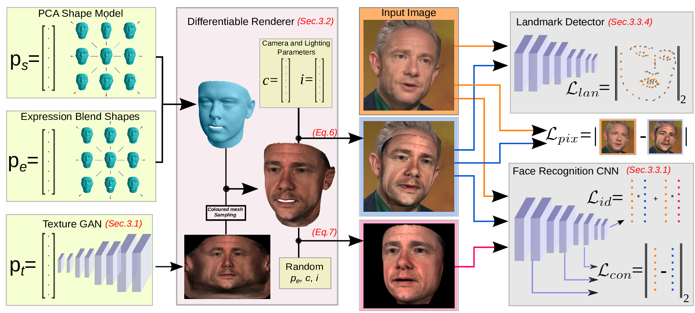

# [GANFIT: Generative Adversarial Network Fitting for High Fidelity 3D Face Reconstruction](http://openaccess.thecvf.com/content_CVPR_2019/html/Gecer_GANFIT_Generative_Adversarial_Network_Fitting_for_High_Fidelity_3D_Face_CVPR_2019_paper.html)

 [Baris Gecer](http://barisgecer.github.io)<sup> 1,2</sup>, [Stylianos Ploumpis](https://ibug.doc.ic.ac.uk/people/sploumpis)<sup> 1,2</sup>, [Irene Kotsia](https://www.mdx.ac.uk/about-us/our-people/staff-directory/profile/kotsia-irene)<sup> 3</sup>, & [Stefanos Zafeiriou](https://wp.doc.ic.ac.uk/szafeiri/)<sup> 1,2</sup>
 <br/>
 <sup>1 </sup>Imperial College London
 <br/>
 <sup>2 </sup>FaceSoft.io
 <br/>
 <sup>3 </sup>University of Middlesex
#### [CVPR2019]

<br/>

<p align="center"></p>


<br/>
(This documentation is still under construction, please refer to our paper for more details)
<br/>

## Abstract

In the past few years a lot of work has been done towards reconstructing the 3D facial structure from single images by capitalizing on the power of Deep Convolutional Neural Networks (DCNNs). In the most recent works, differentiable renderers were employed in order to learn the relationship between the facial identity features and the parameters of a 3D morphable model for shape and texture. The texture features either correspond to components of a linear texture space or are learned by auto-encoders directly from in-the-wild images. In all cases, the quality of the facial texture reconstruction of the state-of-the-art methods is still not capable of modelling textures in  high fidelity. In this paper, we take a radically different approach and harness the power of Generative Adversarial Networks (GANs) and DCNNs in order to reconstruct the facial texture and shape from single images. That is, we utilize GANs to train a very powerful generator of facial texture in UV space. Then, we revisit the original 3D Morphable Models (3DMMs) fitting approaches making use of non-linear optimization to find the optimal latent parameters that best reconstruct the test image but under a new perspective. We optimize the parameters with the supervision of pretrained deep identity features through our end-to-end differentiable framework. We demonstrate excellent results in photorealistic and identity preserving 3D face reconstructions and  achieve for the first time, to the best of our knowledge, facial texture reconstruction with high-frequency details. 

## Approach

<p align="center"></p>
Detailed overview of the proposed approach. A 3D face reconstruction is rendered by a differentiable renderer (shown in purple). Cost functions are mainly formulated by means of identity features on a pretrained face recognition network (shown in gray) and they are optimized by flowing the error all the way back to the latent parameters (ps, pe, pt, c, i, shown in green) with gradient descent optimization. End-to-end differentiable architecture enables us to use computationally cheap and reliable first order derivatives for optimization thus making it possible to employ deep networks as a generator (i.e,. statistical model) or as a cost function.

<br/>

## More Results

<p align="center"></p>
<p align="center"></p>
<p align="center"></p>

<br/>

## Citation
If you find this work is useful for your research, please cite our [paper](http://openaccess.thecvf.com/content_CVPR_2019/html/Gecer_GANFIT_Generative_Adversarial_Network_Fitting_for_High_Fidelity_3D_Face_CVPR_2019_paper.html):

```
@InProceedings{Gecer_2019_CVPR,
author = {Gecer, Baris and Ploumpis, Stylianos and Kotsia, Irene and Zafeiriou, Stefanos},
title = {GANFIT: Generative Adversarial Network Fitting for High Fidelity 3D Face Reconstruction},
booktitle = {The IEEE Conference on Computer Vision and Pattern Recognition (CVPR)},
month = {June},
year = {2019}
}

```

<br/>

## Online Demo
TBA
